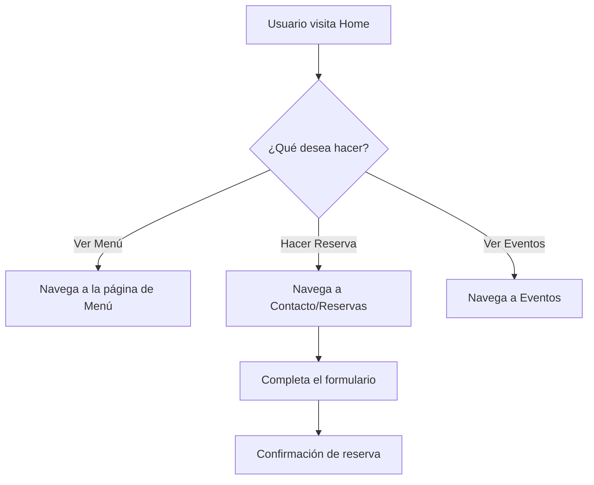

## 1. Descripción General del Producto
Sitio web multi-página para un bar, desarrollado con el objetivo de maximizar el SEO y la velocidad de carga.
- Propósito principal: Mostrar la identidad del bar, el menú, eventos y permitir contacto o reservas, asegurando una experiencia de usuario (UX) óptima.
- Valor del producto: Atraer clientes mediante un diseño visualmente atractivo (pixel perfect según Figma), navegación rápida y excelente posicionamiento en buscadores.

## 2. Características Principales

### 2.1 Módulos de la Aplicación
1. **Página de Inicio**: Hero section, información destacada del bar, destacados del menú, eventos próximos.
2. **Página de Menú**: Lista detallada de bebidas y comidas, separada por categorías.
3. **Página de Eventos**: Calendario o lista de eventos próximos, DJs, bandas en vivo.
4. **Página de Contacto/Reservas**: Formulario de reservas, mapa de ubicación, horarios de atención, enlaces a redes sociales.

### 2.2 Detalles de las Páginas
| Nombre de Página | Nombre del Módulo | Descripción de la Funcionalidad |
|------------------|-------------------|---------------------------------|
| Inicio | Hero Section | Imagen o video de fondo de alta calidad, título principal optimizado para SEO, botón de llamada a la acción (CTA) para reservas. |
| Inicio | Destacados | Sección con las bebidas o platillos más populares. |
| Menú | Categorías | Navegación por pestañas o scroll suave para ver bebidas, cócteles de autor, comida. |
| Eventos | Lista de Eventos | Tarjetas modulares mostrando fecha, nombre del evento y botón para más info. |
| Layout Global | Header | Navegación principal, sticky, con logo y enlaces a las secciones. |
| Layout Global | Footer | Información legal, redes sociales, newsletter, dirección. |

## 3. Proceso Principal
El flujo del usuario consiste en ingresar al sitio, conocer la propuesta de valor del bar y realizar una reserva o ver la carta.

## 4. Diseño de Interfaz de Usuario
### 4.1 Estilo de Diseño
- **Estética general**: Alta fidelidad al diseño de Figma proporcionado (pixel perfect). Estilo moderno y elegante que encaje con la identidad de un bar.
- **Tipografía**: Fuentes seleccionadas para mejorar la legibilidad y el carácter de la marca (a definir según Figma).
- **Colores**: Paleta definida en Figma.
- **Componentización**: Arquitectura modular (Atomic Design o componentes por característica).

### 4.2 Resumen de Diseño de Páginas
| Nombre de Página | Nombre del Módulo | Elementos UI |
|------------------|-------------------|--------------|
| Global | Header | Logo a la izquierda, enlaces al centro, botón de reserva a la derecha. Transparente que cambia a color sólido al hacer scroll. |
| Inicio | Hero Section | Tipografía grande (H1), imagen de alta calidad optimizada, CTA primario. |
| Menú | Lista de Items | Diseño en formato lista o grilla, precios alineados, descripciones concisas. |

### 4.3 Responsividad
Enfoque *Desktop-first* adaptado perfectamente a *Mobile* (Mobile Responsive). Experiencia táctil optimizada para usuarios que buscan el bar desde sus teléfonos móviles.
