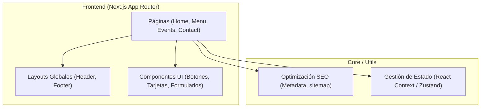

## 1. Diseño de la Arquitectura


## 2. Descripción Tecnológica
- **Framework Frontend**: Next.js (App Router) - Seleccionado por su renderizado del lado del servidor (SSR) y generación estática (SSG), lo cual es ideal para velocidad extrema y el mejor SEO posible.
- **Estilos**: Tailwind CSS - Permite un desarrollo rápido y crear diseños *pixel-perfect* de acuerdo a Figma con clases utilitarias y variables personalizadas.
- **Componentes**: React (Modularizado por páginas y componentes UI reutilizables).
- **Lenguaje**: TypeScript - Para mayor seguridad, autocompletado y una arquitectura robusta.
- **Animaciones (Opcional)**: Framer Motion (para transiciones de página suaves y micro-interacciones premium).
- **Herramienta de Inicialización**: `npx create-next-app@latest`

## 3. Definición de Rutas
| Ruta | Propósito |
|------|-----------|
| `/` | Página de inicio. Presentación del bar. |
| `/menu` | Carta de comidas y bebidas. |
| `/eventos` | Próximos eventos y calendario. |
| `/contacto` | Formulario de reservas y ubicación. |

## 4. Estructura de Directorios Propuesta
```text
src/
├── app/                  # App Router de Next.js (Páginas y Layouts)
│   ├── (rutas)           # /menu, /eventos, /contacto
│   ├── layout.tsx        # Layout principal (Header, Footer)
│   └── page.tsx          # Página de inicio
├── components/           # Componentes modulares
│   ├── layout/           # Header, Footer, Sidebar
│   ├── ui/               # Botones, Inputs, Modales (Pixel Perfect)
│   └── sections/         # Secciones grandes (Hero, MenuList, EventCard)
├── lib/                  # Utilidades y helpers
├── styles/               # Configuración global de Tailwind y CSS variables
└── types/                # Definiciones de interfaces TypeScript
```
